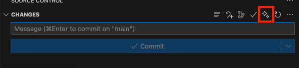

# Claude Code AI Commit Message Button

A VS Code extension that adds an AI-powered sparkle button ✨ to your Git panel for generating intelligent commit messages using Claude AI.

## Features

- **One-click commit message generation**: Add a sparkle button directly in VS Code's Git panel
- **Powered by Claude AI**: Uses Anthropic's Claude to analyze your changes and generate meaningful commit messages
- **Context-aware**: Analyzes your git diff to understand what changes were made
- **Smart formatting**: Generates properly formatted conventional commit messages
- **Seamless integration**: Works directly with VS Code's built-in Git interface

## Requirements

- VS Code 1.103.0 or higher
- Claude Code CLI ([`@anthropic-ai/claude-code`](https://docs.anthropic.com/en/docs/claude-code/quickstart)) installed and configured
- Git repository initialized in your workspace
- Internet connection for AI generation

## Installation

1. Install the extension from the VS Code Marketplace
2. Open a project with a Git repository
3. Look for the sparkle ✨ button in your Git panel

## How to Use

1. Make some changes to your code
2. Stage your changes in VS Code's Git panel
3. Click the sparkle ✨ button next to the commit message input
4. The extension will analyze your changes and generate a commit message
5. Review and edit the generated message if needed
6. Commit your changes

## Extension Settings

This extension contributes the following settings:

* `claude-code-ai-commit-message-button.authToken`: Your Anthropic API key (optional - can also use ANTHROPIC_AUTH_TOKEN environment variable)
* `claude-code-ai-commit-message-button.baseUrl`: Base URL for Anthropic API (optional - can also use ANTHROPIC_BASE_URL environment variable)
* `claude-code-ai-commit-message-button.model`: Claude model to use (default: claude-4-sonnet)
* `claude-code-ai-commit-message-button.maxTokens`: Maximum tokens for response (default: 200)

## Privacy & Security

- Your code changes are sent to Anthropic's API for analysis
- No code is stored permanently - only used for generating the commit message
- API key is stored securely in VS Code's settings

## Release Notes

### 0.0.1

Initial release featuring:
- Sparkle button integration in Git panel
- Claude AI-powered commit message generation
- Basic configuration options

## Contributing

Found a bug or have a feature request? Please open an issue on our [GitHub repository](https://github.com/taltukh/claude-code-ai-commit-message-button).

## License

MIT License - see LICENSE file for details.

**Enjoy smarter commits with AI! ✨**
